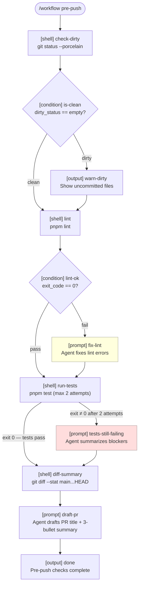

# Workflows

Workflows are multi-step YAML files that let you automate repeatable development processes by composing shell commands, agent prompts, and branching logic into a single runnable pipeline. Each step has access to the full LLM context — a `prompt` step doesn't just print text, it runs a full agent turn that can call tools, edit code, and adapt to the results of previous steps.

## File locations

Workflows are loaded from two directories, with project-level definitions overriding global ones by name:

```
~/.copair/workflows/     # Global — available in every project
.copair/workflows/       # Project-level — overrides global by name
```

Files must end in `.yaml` or `.yml`. The workflow `name` field (not the filename) is what you use to invoke it.

## Invocation

```
/workflow <name>
/workflow <name> key=value key2=value2
```

Override any declared input at invocation time with `key=value` pairs. Press `Ctrl+C` to cancel a running workflow.

---

## Step reference

Every step requires `id` (unique within the workflow) and `type`. All other fields are type-specific.

### `prompt`

Sends a message to the agent. The agent runs a full turn — it can call tools, read files, edit code, and reason before responding.

| Field | Type | Required | Description |
|:------|:-----|:---------|:------------|
| `id` | string | yes | Unique step identifier |
| `type` | `prompt` | yes | Step type |
| `message` | string | yes | The prompt text sent to the agent. Supports `{{variables}}`. |
| `max_iterations` | string (number) | no | Run this step up to N times. |
| `loop_until` | string | no | Expression checked after each iteration; breaks early if met. Use `{{exit_code}} == 0`. |
| `on_max_iterations` | string (step id) | no | Step id to run when max iterations are reached without `loop_until` being satisfied. |

### `shell`

Runs a shell command in the project's working directory. stdout and stderr are both captured and streamed to the terminal.

| Field | Type | Required | Description |
|:------|:-----|:---------|:------------|
| `id` | string | yes | Unique step identifier |
| `type` | `shell` | yes | Step type |
| `command` | string | yes | Shell command to run. Supports `{{variables}}`. |
| `capture` | string | no | Variable name to store combined stdout+stderr. Accessible as `{{capture_name}}` in later steps. |
| `continue_on_error` | boolean | no | If `true`, a non-zero exit code does not halt the workflow. Default: `false`. |
| `max_iterations` | string (number) | no | Run this step up to N times. |
| `loop_until` | string | no | Expression with `{{exit_code}}`; breaks the loop early when met. |
| `on_max_iterations` | string (step id) | no | Step id to run when max iterations are reached. |

### `command`

Invokes a copair slash command programmatically.

| Field | Type | Required | Description |
|:------|:-----|:---------|:------------|
| `id` | string | yes | Unique step identifier |
| `type` | `command` | yes | Step type |
| `command` | string | yes | The command input string (e.g. `spec:approve requirements`). Supports `{{variables}}`. |

### `condition`

Evaluates a simple expression and jumps to a different step based on the result. Supports equality checks: `"value == other"`.

| Field | Type | Required | Description |
|:------|:-----|:---------|:------------|
| `id` | string | yes | Unique step identifier |
| `type` | `condition` | yes | Step type |
| `if` | string | yes | Expression to evaluate. Supports `{{variables}}`. |
| `then` | string | no | Step id to jump to if the expression is true. |
| `else` | string | no | Step id to jump to if the expression is false. |

Use the special value `done` to end the workflow early:

```yaml
- id: check-result
  type: condition
  if: "{{steps.run-tests.exit_code}} == 0"
  then: done
  else: fix-failures
```

Skipped steps (bypassed by a condition jump) are shown in the console as `[step N/total] stepId [skipped]`.

### `output`

Prints a message to the terminal. No agent involvement.

| Field | Type | Required | Description |
|:------|:-----|:---------|:------------|
| `id` | string | yes | Unique step identifier |
| `type` | `output` | yes | Step type |
| `message` | string | yes | Text to print. Supports `{{variables}}`. Multi-line YAML blocks work. |

---

## Variable system

All `message`, `command`, and `if` fields support `{{variable}}` substitution. Variables are resolved in this order:

### 1. Step result references

Access the result of any previously-run step:

```
{{steps.<step-id>.exit_code}}   # Integer exit code of a shell step
{{steps.<step-id>.output}}      # Combined stdout+stderr of a shell step
```

### 2. Workflow inputs and captured variables

Workflow input defaults, user overrides, and values captured via `capture:` on shell steps all live in the same flat namespace:

```
{{dirty_status}}        # captured from a shell step with capture: dirty_status
{{base_branch}}         # declared as a workflow input
{{max_test_attempts}}   # declared as a workflow input with a default
```

### 3. Context variables

Always available regardless of workflow inputs:

```
{{model}}       # Current model ID (e.g. claude-opus-4-7)
{{cwd}}         # Working directory path
{{branch}}      # Current git branch name
{{env.VAR}}     # Any environment variable, e.g. {{env.NODE_ENV}}
```

### Resolution order

For each `{{key}}`:
1. `{{steps.id.field}}` patterns resolved first
2. Workflow inputs and captured variables
3. Context variables (`model`, `cwd`, `branch`, `env.*`)
4. If unresolved, the placeholder passes through as-is

---

## Loop and retry patterns

### Basic retry with `max_iterations` + `loop_until`

```yaml
- id: run-tests
  type: shell
  command: pnpm test
  capture: test_output
  continue_on_error: true
  max_iterations: "3"
  loop_until: "{{exit_code}} == 0"
```

The step runs up to 3 times. If `{{exit_code}} == 0` is satisfied on any attempt, the loop exits early. The captured `test_output` always reflects the last run.

### `on_max_iterations` handler

When a loop exhausts all attempts without `loop_until` being satisfied, the engine fires the named step:

```yaml
- id: run-tests
  type: shell
  command: pnpm test
  capture: test_output
  continue_on_error: true
  max_iterations: "2"
  loop_until: "{{exit_code}} == 0"
  on_max_iterations: tests-still-failing

- id: tests-still-failing
  type: prompt
  message: |
    Tests still failing after 2 attempts:
    ```
    {{test_output}}
    ```
    Summarize what's stuck and whether pushing is safe.
```

**Important:** The `on_max_iterations` step is listed in the sequential step list but the engine controls when it runs:
- If the loop exits early (condition met) → the named step is shown as `[skipped]` and execution jumps past it
- If the loop reaches max iterations → the named step fires exactly once with the actual failure output, then execution continues after it

This means `{{test_output}}` in the handler always contains failure output, never a passing run's output.

---

## The pre-push workflow

Copair ships a `pre-push` workflow in `.copair/workflows/pre-push.yaml` that it uses internally. It validates a branch is ready to push — lint, tests, diff summary, and PR draft — in a single command.

```
/workflow pre-push
```

### Flow diagram



### Step-by-step walkthrough

**Happy path (clean tree, lint passes, tests pass):**

1. `check-dirty` — runs `git status --porcelain`, captures output as `dirty_status`
2. `is-clean` — `dirty_status == ""` is true → jumps to `lint` (`warn-dirty` shown as skipped)
3. `lint` — runs `pnpm lint`
4. `lint-ok` — `exit_code == 0` is true → jumps to `run-tests` (`fix-lint` shown as skipped)
5. `run-tests` — runs `pnpm test`; tests pass → `tests-still-failing` shown as skipped
6. `diff-summary` — runs `git diff --stat main...HEAD`
7. `draft-pr` — agent drafts a PR title and 3-bullet summary from the diff stat
8. `done` — prints "Pre-push checks complete."

**Dirty working tree:** `is-clean` is false → `warn-dirty` prints the uncommitted files (non-blocking), then continues to `lint`.

**Lint failure:** `lint-ok` is false → `fix-lint` sends lint output to the agent to edit and fix. Execution then continues to `run-tests`.

**Test failure (both attempts):** `run-tests` exhausts 2 attempts → `tests-still-failing` fires once with the actual failure output. Agent summarizes the blocker. Execution continues to `diff-summary` and `draft-pr`.

### Annotated YAML

```yaml
name: pre-push
description: Validate branch is ready to push — lint, tests, diff summary, PR draft
inputs:
  - name: base_branch
    description: Branch to compare against for the diff summary
    default: main
  - name: max_test_attempts
    default: "2"

steps:
  - id: check-dirty
    type: shell
    command: git status --porcelain
    capture: dirty_status          # stored as {{dirty_status}}
    continue_on_error: true

  - id: is-clean
    type: condition
    if: "{{dirty_status}} == "     # empty string = clean tree
    then: lint                     # clean → skip warn-dirty
    else: warn-dirty

  - id: warn-dirty
    type: output
    message: |
      Uncommitted changes detected:
      {{dirty_status}}
      Continuing — commit or stash before pushing.

  - id: lint
    type: shell
    command: pnpm lint
    capture: lint_output
    continue_on_error: true

  - id: lint-ok
    type: condition
    if: "{{steps.lint.exit_code}} == 0"
    then: run-tests                # lint passed → skip fix-lint
    else: fix-lint

  - id: fix-lint
    type: prompt
    message: |
      Lint failed:
      ```
      {{lint_output}}
      ```
      Fix the reported issues without disabling rules. Re-run `pnpm lint` when done.

  - id: run-tests
    type: shell
    command: pnpm test
    capture: test_output
    continue_on_error: true
    max_iterations: "{{max_test_attempts}}"
    loop_until: "{{exit_code}} == 0"
    on_max_iterations: tests-still-failing

  - id: tests-still-failing
    type: prompt
    message: |
      Tests still failing after {{max_test_attempts}} attempts:
      ```
      {{test_output}}
      ```
      Summarize what's stuck and whether pushing is safe.

  - id: diff-summary
    type: shell
    command: git diff --stat {{base_branch}}...HEAD
    capture: diff_stat
    continue_on_error: true

  - id: draft-pr
    type: prompt
    message: |
      Draft a PR title (≤ 70 chars) and a 3-bullet summary for these changes vs {{base_branch}}:
      ```
      {{diff_stat}}
      ```

  - id: done
    type: output
    message: Pre-push checks complete.
```

---

## Agent wiring

### Git hooks

Add a `.git/hooks/pre-push` script:

```bash
#!/bin/sh
copair --workflow pre-push
```

Every `git push` now automatically runs lint, tests, and generates a PR draft. If `fix-lint` fires, the agent edits the actual source files before tests run — it doesn't just flag issues.

### CI pipelines

Install copair in your CI container and invoke workflows as pipeline steps:

```yaml
# .github/workflows/ci.yml
- name: Pre-push checks
  run: copair --workflow pre-push base_branch=main
```

Because each `prompt` step is a full agent turn, CI can interpret ambiguous errors, edit code to fix failures, and produce human-readable summaries in the pipeline log.

### MCP-connected agents

Any MCP server that can emit messages to copair's input stream can trigger a workflow. An orchestrating agent can chain workflows across repositories or invoke them in response to external events (webhook, PR open, deployment complete):

```
emit: /workflow review-changes base_branch=main
```

### Why workflows beat shell scripts

A shell script is a fixed sequence of commands. A workflow is a sequence of **decisions**. Each `prompt` step is a full agent turn — the model reads context, calls tools, edits code, and adapts. `fix-lint` doesn't just re-run lint after a no-op; it reasons about what broke, edits the file, and validates the fix. Any repeatable process that currently requires a human in the loop — review, triage, draft, approve — can be expressed as a workflow and run autonomously.
